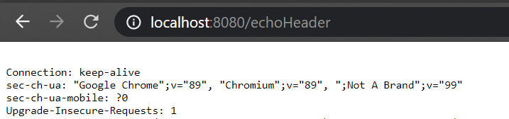

## CK Server
This is a http server, build from scratch using `Socket`.

### Usage

> CkServerDriver.java
```java
public class CkServerDriver {

  public static void main(String[] args) {
    int port = 8080;
    CkHttpServer server = new CkHttpServer(new InetSocketAddress(port));

    // Register Handlers
    server.addHandler("/", HttpMethod.GET,new RootHandler());
    server.addHandler("/echoHeader", HttpMethod.GET,new EchoHeaderHandler());
  
    // Start server
    server.start();
  }
}
```

> EchoHeaderHandler.java
```java
public class EchoHeaderHandler implements Handler {

  // Handler that prints get request headers
  @Override
  public void handle(CkHttpExchange he) throws IOException {

    // Read Headers
    List<String> headers = he.getRequestHeaders();
    StringBuilder response = new StringBuilder();
    for (String header : headers) {
      response.append(header).append("\n");
    }

    // Write Response
    he.sendResponseHeaders(HttpStatusCode.OK, ContentType.TEXT);
    OutputStream os = he.getResponseBody();
    os.write(response.toString().getBytes());
    os.close();
  }
}
```

### Output


### Features
- Similar to `com.sun.net.*` HTTPServer.
    - `Exchange` added
    - `Handler` added

### TODO
1. Support `POST` body etc
2. Error handler
2. Performance improvement
2. SSL support